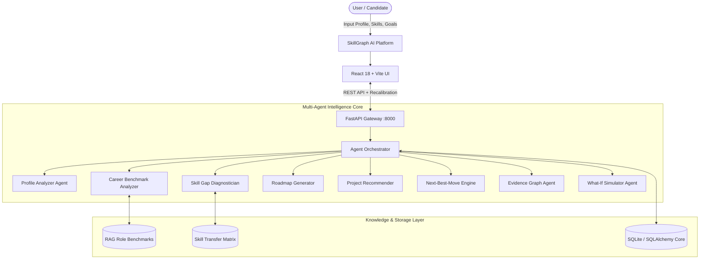

# SkillGraph AI — Autonomous Multi-Agent Career Intelligence & Skill Evidence Platform

<div align="center">

[](https://fastapi.tiangolo.com)
[](https://react.dev)
[](https://vitejs.dev)
[](https://www.python.org)
[](https://www.sqlalchemy.org)
[](https://opensource.org/licenses/MIT)

**Turn your potential into real opportunities.**  
*An enterprise-grade, evidence-backed career intelligence engine powered by autonomous multi-agent systems and real-time labor market telemetry.*

</div>

---

## 🌟 Executive Overview

**SkillGraph AI** (formerly SkillTwin AI) is an agentic platform designed to bridge the gap between learner potential and industry employment. Unlike static resumes or generic roadmaps, SkillGraph AI models an interactive "Digital SkillTwin" for every candidate—combining **evidence-backed skill provenance**, **multi-agent gap diagnosis**, **real-time recalculation**, and **what-if career trajectory simulations**.

---

## 🚀 Core Architectural Features

### 1. ⚡ Autonomous Multi-Agent Pipeline
The backend is driven by specialized autonomous agents orchestrated sequentially and reactively:
- **Agent 1: Profile Analyzer**: Normalizes experience, parses portfolio artifacts, and measures confidence.
- **Agent 2: Career Benchmark Analyzer**: Queries RAG knowledge bases for role benchmarks, competency distributions, and critical skills.
- **Agent 3: Skill Gap Diagnostician**: Computes mathematical deficits between current abilities and target role baselines.
- **Agent 4: Adaptive Roadmap Generator**: Formulates phased, practical learning exercises calibrated to the user's weekly commitment.
- **Agent 5: Project Recommender**: Synthesizes production-ready capstone project specs that close diagnosed deficits.
- **Agent 6: Next-Best-Move Engine**: Isolates the single highest-leverage immediate action with estimated completion days and gap-closing impact.
- **Agent 7: Evidence Graph Agent**: Audits skill provenance, classifying competencies into **Claimed**, **Demonstrated**, or **Verified**.
- **Agent 8: What-If Trajectory Simulator**: Computes fit percentages, gap counts, and timelines across alternative career pathways simultaneously.

---

### 2. 💎 Interactive Cockpit Interface
- **Holographic 3D Orbit System**: Dynamic visual representation of core telemetry (*Skills Analyzed, Careers Explored, Projects Mapped, Opportunities Matched, Goals Aligned, Growth Continuous*).
- **Your Career Journey**: 4-station milestone stepper (*Current State → Build Skills → Gain Evidence → Reach Opportunities*) with interactive goal recalibration.
- **Your Next Best Move**: High-impact card showcasing active capstones (e.g., *Complete RAG Chatbot Project*), difficulty rating, and estimated effort.
- **Career What-If Simulator**: Instant switching between target roles (*AI Engineer, Data Analyst, ML Engineer, + Custom Paths*) with real-time progress bar telemetry.
- **Skill Evidence Graph**: SVG node diagram tracing evidence from *Resume, GitHub Repositories, Assessments, and Coursework* into core skills with evidence strength metrics.
- **SkillTwin Evolution Timeline**: S-curve progression tracker featuring *"You are here"* status indicators and competency milestone history.
- **Skill Transfer Intelligence**: Intelligent bridging showing how existing disciplines (e.g. *Python → Data Analysis*, *Excel → Data Visualization*) reduce learning time.
- **Curated Opportunities**: Direct matching to live internships, remote positions, and open-source contributions.
- **Global Command Palette (`Ctrl + K`)**: Universal search across careers, skills, benchmarks, and AI advisor queries.

---

## 🏗️ System Architecture



---

## 📂 Repository Structure

```
Skill_Graph_AI_System/
├── backend/
│   ├── app/
│   │   ├── agents/               # 8 Autonomous AI Agents
│   │   │   ├── career_analyzer.py
│   │   │   ├── evidence_agent.py
│   │   │   ├── next_move_agent.py
│   │   │   ├── orchestrator.py
│   │   │   ├── profile_analyzer.py
│   │   │   ├── project_recommender.py
│   │   │   ├── roadmap_agent.py
│   │   │   ├── skill_gap_analyzer.py
│   │   │   └── what_if_agent.py
│   │   ├── api/
│   │   │   └── endpoints/        # REST Route Handlers (Dashboard, Analysis, etc.)
│   │   ├── database/             # SQLAlchemy ORM Models & DB Sessions
│   │   ├── rag/                  # RAG Knowledge Base & Transfer Matrix
│   │   ├── schemas/              # Pydantic v2 Models & Payloads
│   │   └── main.py               # FastAPI Application Entry Point
│   ├── requirements.txt          # Python Backend Dependencies
│   └── .env.example              # Sample Environment Variables
├── frontend/
│   ├── src/
│   │   ├── components/           # UI Components
│   │   │   ├── TopNavbar.jsx     # Navigation Header with Search & Avatar
│   │   │   ├── Sidebar.jsx       # 12-Item Navigation Sidebar
│   │   │   ├── OverviewCockpit.jsx # Main Dashboard View
│   │   │   ├── CommandPalette.jsx # Ctrl+K Search Modal
│   │   │   ├── GoalEditorModal.jsx # Goal Configuration Modal
│   │   │   ├── CareerWhatIfSimulator.jsx
│   │   │   ├── EvidenceGraphPanel.jsx
│   │   │   ├── NextBestMoveCard.jsx
│   │   │   ├── RoadmapTimeline.jsx
│   │   │   ├── SkillEvolutionTimeline.jsx
│   │   │   └── SkillTwinProfile.jsx
│   │   ├── services/
│   │   │   └── api.js            # Axios / Fetch API Client with Fail-Safe Fallbacks
│   │   ├── App.jsx               # Root Application Router
│   │   ├── index.css             # Obsidian Titanium Design System
│   │   └── main.jsx
│   ├── package.json              # Frontend Node Dependencies
│   └── vite.config.js            # Vite Configuration
├── docs/
│   └── assets/                   # Architecture & UI Visuals
└── README.md
```

---

## ⚡ Quickstart Guide

### Prerequisites
- **Python**: 3.10 or higher
- **Node.js**: 18.0 or higher
- **npm**: 9.0 or higher

---

### 1. Clone the Repository
```bash
git clone https://github.com/Sudharsana125/Skill_Graph_AI_System.git
cd Skill_Graph_AI_System
```

---

### 2. Backend Setup
```bash
# Navigate to workspace root
cd Skill_Graph_AI_System

# Install Python dependencies
pip install -r backend/requirements.txt

# Start the FastAPI backend
python -m uvicorn backend.app.main:app --host 127.0.0.1 --port 8000 --reload
```
*Backend runs at `http://127.0.0.1:8000` (Swagger docs available at `http://127.0.0.1:8000/docs`).*

---

### 3. Frontend Setup
```bash
# In a separate terminal, navigate to frontend
cd frontend

# Install Node dependencies
npm install

# Start Vite dev server
npm run dev -- --host 127.0.0.1 --port 5173
```
*Frontend runs at `http://127.0.0.1:5173`.*

---

## 🛠️ API Reference Overview

| Method | Endpoint | Description |
| :--- | :--- | :--- |
| `GET` | `/health` | System health check and agent heartbeat |
| `GET` | `/api/demo` | Retrieves instant demonstration profile (Sudharsana) |
| `GET` | `/api/dashboard/{user_id}` | Complete SkillTwin dashboard state |
| `POST` | `/api/analyze` | Executes end-to-end multi-agent assessment pipeline |
| `POST` | `/api/progress/update` | Live recalibration on task milestone completion |
| `POST` | `/api/simulator/what-if` | Simulates multi-path career trajectory fit scores |
| `POST` | `/api/assistant/chat` | AI Career Intelligence Advisor interactive query |

---

## 🛡️ License

This project is licensed under the [MIT License](LICENSE).

---

## 👤 Author

**Sudharsana**  
- GitHub: [@Sudharsana125](https://github.com/Sudharsana125)
- Repository: [Skill_Graph_AI_System](https://github.com/Sudharsana125/Skill_Graph_AI_System)
